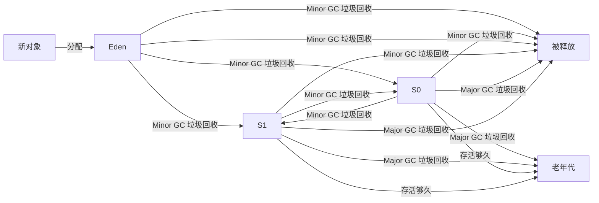

# Java 内存机制

Java 的内存分为 程序计数器, Java 虚拟机栈, Java 堆, 方法区 四个部分, 其中最大的是 Java 堆 (大部分数组或对象实例都在这里分配, 所以垃圾收集器一般也是针对这个部分管理, 所以也被称为 GC 堆)

## 程序计数器

当前线程所执行的字节码指令的行号指示器

## Java 虚拟机栈

存放 Java 方法执行的内存模型, 每个方法执行时 JVM 会创建一个栈帧用于存储一些局部变量等数据

## Java 堆

用于存放对象实例和数组, 一般由 GC (垃圾收集器) 进行管理

现代的垃圾收集器的原理一般如下:

- 当有新对象实例化后, 就会被分配到 Eden 区
- Survivor 区分为 S0 和 S1 两个区
- 当 Eden 区满后, 就会执行一次 Minor GC 垃圾回收, 将 Eden 区和其中一个 Survivor 区的存活的对象复制到 另一个 Survivor 区, 然后清空 Eden 和原来的 Survivor区
- 当对象在 S0 和 S1 区存活了较长时间, 就会被复制到老年代区, 当 Survivor 区满后, 也会执行一次 Major GC / Full GC 垃圾回收, 将 Survivor 区的存活对象移动到老年代区, 然后清空 Survivor 区

## 方法区

用于存储已被 JVM 加载的类信息, 常量, 静态变量, 即时编译器编译后的代码等数据