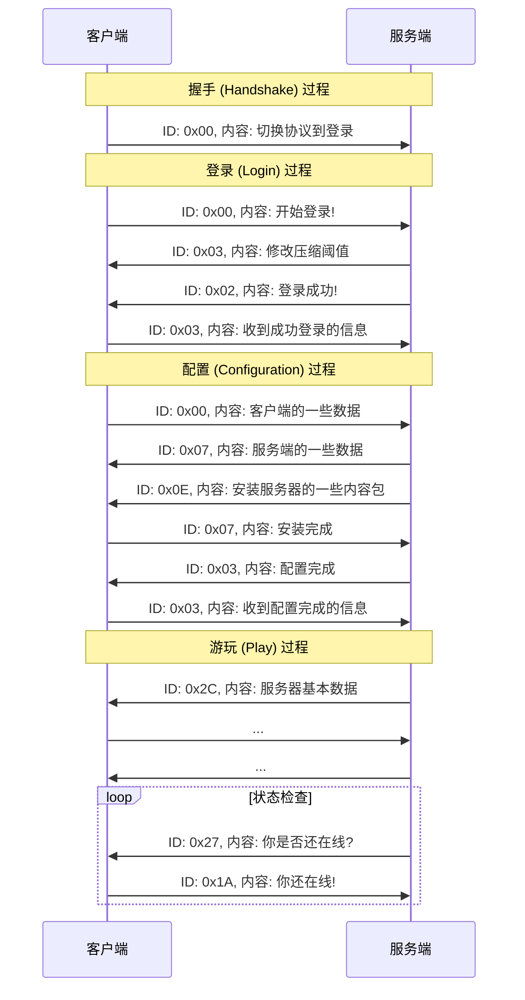

# Minecraft 网络通信

:::warning 注意
本文仅针对 Minecraft Java 版的网络通信展开赘述
:::

Minecraft 使用 TCP 协议进行网络通信, 它的服务端和客户端分离, 客户端和服务端之间通过发包进行通信 (你的单人游戏相当于开启了一个迷你服务端)

包 (packet) 是 Minecraft 的网络通信的基本单位, 每个包都有一定的格式:

1. Packet Length (varint): 包的长度
2. Packet ID (varint): 包的 ID
3. Payload: 包的负载 (内容), 可选, 格式根据不同的包而定

接着我们来看看 Minecraft 客户端与服务端建立连接的全过程:

:::info 信息
更多信息请参考 [Minecraft Wiki](https://minecraft.wiki/w/Java_Edition_protocol/Packets)
:::