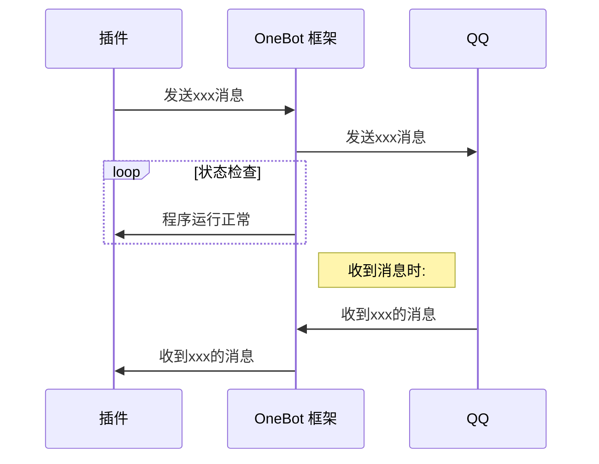

# QQ 机器人

## 概述

目前市面上大部分 QQ 机器人插件都是基于 OneBot 或 go-cqhttp 协议开发的 (因为 QQ 本身的 API 限制较多), 而这些机器人插件都需要通过对接 OneBot 框架才能运行, 具体原理如下图:

所以, 在安装一些基于 OneBot 协议的 QQ 机器人插件前, 你通常需要安装一个 OneBot 框架 (如 Lagrange.OneBot, Napcat, LLoneBot)

## 推荐

### [AQQBot](https://www.minebbs.com/resources/aqqbot.9921/)

由本文撰写者编写的 QQ 机器人插件, 基于 OneBot 协议, 同时支持 Velocity, 功能丰富

### [EasyBot](https://www.minebbs.com/resources/easybot-minecraft-folia.7918/)

另一款优秀的 QQ 机器人插件, 也是基于 OneBot 协议, 功能强大, 不过需要预先安装一个 EasyBot 的管理页面前端程序才能使用

### [HuHoBot](https://www.minebbs.com/resources/huhobot-qq.9759/)

基于 QQ 本身的 API 开发的 QQ 机器人插件, 虽然功能匮乏, 但是使用官方的 API 更加安全稳定