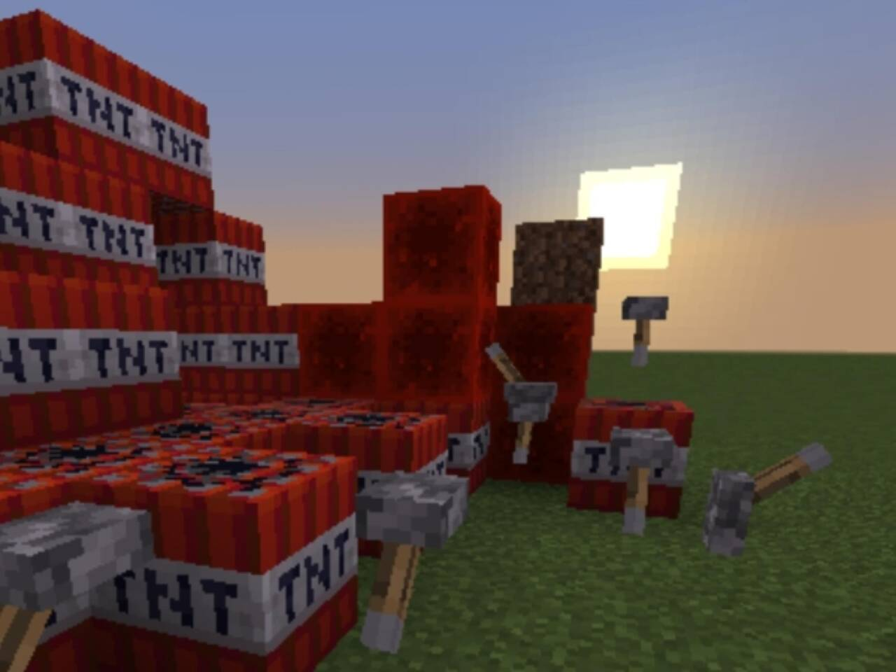

# 基岩版核心 & 服务端

      基岩版服务端核心以轻量化、跨平台为特色，拥有对基岩版的高度支持

## BDS (Bedrock Dedicated Server)
- **定位**​​：官方原版服务端 支持行为包 材质包 scriptAPi
- **特点**：完全基岩版特性 BE兼容性最强 基岩版的vanilla~~确信~~
- **优点与缺点**：
  - 优点: 是官方推出的服务端 拥有基岩版所有原版特性
  - 缺点: 一些社区反馈的Bug不能及时修复 扩展性较差且性能较差
- **下载链接**：https://www.minecraft.net/zh-hans/download/server/bedrock

###  BDS & LLBDS & Endstone
| 项     | BDS   | LLBDS   | Endstone  |
|-------|------|------|------|
| 社区活跃性 | 差    | 高    | 高    |
| 更新速度 | 高    | 较高    | 较高    |
| 稳定性  | 较差   | 高   | 高   |
| 插件兼容性 |无 |高 | 高 |

- BDS下载链接：https://www.minecraft.net/zh-hans/download/server/bedrock
- LL＋BDS下载链接:https://github.com/LiteLDev/LeviLamina
- Endstone下载链接: https://github.com/EndstoneMC/endstone
> ##### 注意 以上均需要以BDS为基础 LL与Endstone均为插件加载器
> ##### 并且LLBDS在Linux环境下运行不佳 而Endstone无需考虑这个问题

## Nukkit
- **定位**​​：早期基岩版服务端代表，现生态趋于边缘化 性能优化较强 较稳定 
- **特点**：依靠Java编写 但性能优化堪称极致 基岩版的Paper~~确信~~
- **优点与缺点**：
  - 优点: 性能较高 作为老牌核心稳定性无问题 适合小游戏类服务端
  - 缺点: 现如今社区活跃度差  原版特性不全 逐渐跟不上潮流

### 主流分支核心
| 核心名称       | 版本 | 链接   |JAVA版本| 状态   |
|----------------|--------------|---------|---------|---------|
| NukkitX   |最新 | https://www.minebbs.com/resources/nukkitx.32/|17＋| 活跃|
| Nukkit-MOT|最新|https://github.com/MemoriesOfTime/Nukkit-MOT |17＋|活跃| 
| PowerNukkitX|  最新|https://github.com/PowerNukkitX/PowerNukkitX|17＋|活跃|
| PetterM1Edition|最新 | https://github.com/PetteriM1/NukkitPetteriM1Edition/|17＋|活跃| 
| Lumi|最新 | https://github.com/KoshakMineDEV/Lumi/|21＋|活跃|

## Allay
- **定位**​​：划时代的MCBE服务端软件
- **特点**：使用 Java 编写 在保持高性能的同时保持高扩展性 基岩版的folia~~确信~~
- **优点与缺点**：
  - 优点: 性能极高 解决了 Nukkit 系服务端在高负载环境下存在的问题 大量BDS新协议功能
  - 缺点: 现在仍处于实验阶段 不推荐正式开服
- **下载链接**：https://github.com/AllayMC/Allay/releases

#### Allay梗图

## Serenity
- **定位**​​：基于 Rust 和 TypeScript 构建的 Minecraft 基岩版服务器
- **优点与缺点**：
  - 优点: 性能极高
  - 缺点: 尚未测试
- **下载链接**：https://github.com/SerenityJS/serenity
