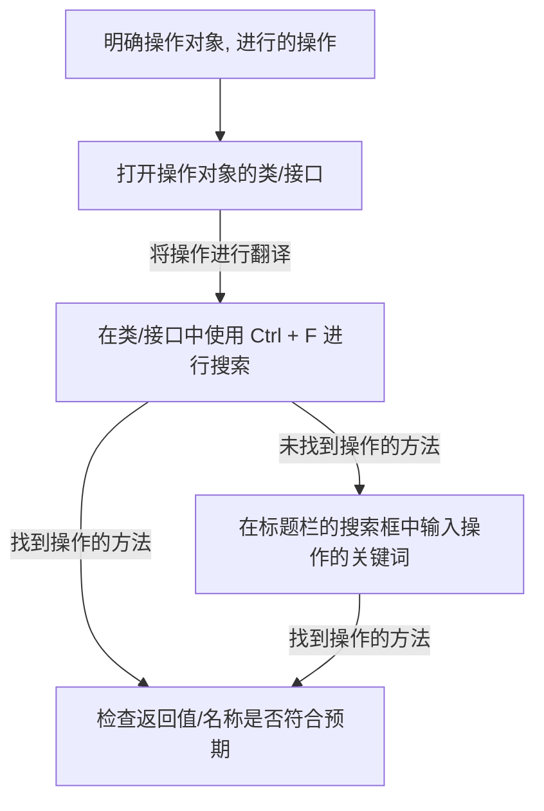

# JavaDoc

JavaDoc 是一款 Java 文档生成工具，它可以从源代码中提取注释并生成 HTML 格式的文档, 对 Java 开发者来说, JavaDoc 是一个很有用的工具

JavaDoc 一般由构建系统生成, 各大项目会把 JavaDoc 文档托管在服务器上, 以供开发者查阅

## JavaDoc 总览界面

以下是 spigot-api 1.21.8 的 JavaDoc 的总览界面:

先来讲标题栏, 有八个部分:
- OVERVIEW: 总览, 显示了文档的概述及所有的包
- PACKAGE: 包, 在点入某一个包时会自动切换到该部分, 显示了这个包的父包及所有的类/接口文件
- CLASS/INTERFACE: 类/接口, 显示了类的继承关系, 实现的接口, 字段, 方法, 构造器等信息
- USE: 在点开类后可以点 USE 按钮, 显示了使用这个类/接口的所有类的信息
- TREE: 树形图, 显示了类之间的的继承关系
- DEPRECATED: 过时的内容, 显示了被标记为 @Deprecated (过时) 的类/接口/方法
- INDEX: 索引, 相当于一个字典, 可以看到各个字母开头的类/接口/方法, 也可以进行筛选
- HELP: 帮助, 显示了 JavaDoc 的使用说明

在标题栏的下面还有个浅蓝色的栏, 它的右侧有一个搜索框, 可以用来搜索文档中的类/接口/方法等内容, **这也是开发者寻找需要的功能时最常用的功能**

## JavaDoc 包界面

接着来讲 JavaDoc 的包界面, 如图是一个示例 (点开了 `org.bukkit.attribute` 包):

包界面有两个部分, 一个是与其相关的包 (即 Related Packages 部分, 如父包 `org.bukkit`, 在有些包也会有子包), 另一个部分是在其下方的类/接口列表 (Class/Interfaces 部分), 显示了这个包下所有的类/接口文件

每个类/接口文件都有一行, 包括名称 (Class) 和描述信息 (Description)

## JavaDoc 类/接口界面

接着来讲 JavaDoc 的类/接口界面, 如图是一个示例 (点开了 `Attributable` 类):

界面上方显示了它的类名和类型 (Class 类 / Interface 接口), 在它的下方有与其相关的类, 接口等, 再下方是类的定义 ([修饰符] class 类名) 和介绍

继续往下看, 有两个部分, 分别是 Method Summary (方法总览) 和 Method Detail (方法详情), 前者显示了类的所有方法的所在类, 方法参数和简短描述, 后者则具体介绍了类的定义, 参数, 返回, 抛出的异常等

:::tip 提示
如何在 JavaDoc 中找到自己想要的东西?

假设你要获取玩家的位置信息:

1. 翻译: `位置` -> `Location`, `Position`
2. 在玩家的类 (`Player`) 里通过 Ctrl + F 浏览器搜索功能分别寻找这两个关键词, 并查看返回值是否为这些关键词或者与其相关
3. 若第二步未找到, 在标题栏的搜索框中分别输入两个关键词查找方法 (根据你查找的内容来判断是查找方法还是类/接口)
4. 对第三步搜索到的东西进行名称筛选 (一般获取的方法都以 `get` 开头, 设置的方法都以 `set` 开头)
5. 对第三步搜索到的东西进行对象筛选 (查看这个方法是哪一个类/接口的, 你使用的类/接口是否与这个方法所属的类/接口有关)

总结来说:

:::