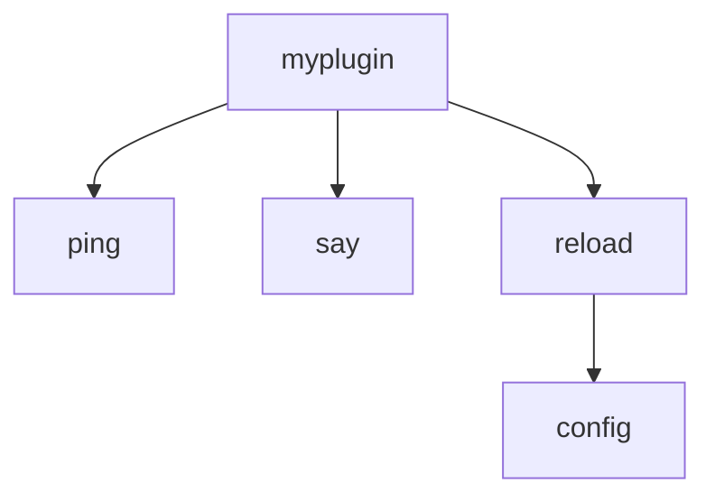

# Paper 插件结构

:::warning 警告
Paper 插件目前仍在实验阶段, 可能在随后会有改动, 建议不要使用

Paper 插件的开发包 (paperweight-userdev) 官方仅提供了 Gradle 构建系统的参考实现, 如果你使用的是 Maven 构建系统, 若对 Maven 没有深入了解, 建议使用 Paper API 而非 Paper 插件开发包
:::

## 目录结构

一个基本的 Paper 插件的目录结构如下:

```text
|- build.gradle (Gradle/Groovy DSL)
|- build.gradle.kts (Gradle/Kotlin DSL)
|- pom.xml (Maven)
|- src
|  |- main
|  |  |- java
|  |  |  |- top
|  |  |  |  |- alazeprt
|  |  |  |  |  |- myplugin
|  |  |  |  |  |  |- MyPlugin.java
|  |  |- resources
|  |  |  |- paper-plugin.yml
|- settings.gradle (Gradle/Groovy DSL)
|- settings.gradle.kts (Gradle/Kotlin DSL)
```

- `paper-plugin.yml`: 插件的基本信息配置, 包括插件名, 主类所在位置, 插件版本等
- `MyPlugin.java`: 插件的主类

## 引入依赖 (Paper API)

:::warning 警告
Paper API 和 Spigot API 只能引入其中一个, 否则会有冲突 (一般来说 Paper API 也包含了 Spigot API 的大部分内容)
:::

:::info 信息
引入依赖的教程来自 [Paper 官方网站](https://docs.papermc.io/paper/dev/project-setup)
:::

:::code-group

```xml [pom.xml]
<!-- 将这段内容添加到 pom.xml 的 repositories 标签下 -->
<repository>
    <id>papermc</id>
    <url>https://repo.papermc.io/repository/maven-public/</url>
</repository>

<!-- 将这段内容添加到 pom.xml 的 dependencies 标签下 -->
<dependency>
    <groupId>io.papermc.paper</groupId>
    <artifactId>paper-api</artifactId>
    <version>1.16.5-R0.1-SNAPSHOT</version>
    <scope>provided</scope>
</dependency>
```

```groovy [build.gradle]
repositories {
    // 将以下内容添加到 repositories 块中
    maven {
        name = 'papermc'
        url = 'https://repo.papermc.io/repository/maven-public/'
    }
}

dependencies {
    // 将以下内容添加到 dependencies 块中
    compileOnly 'io.papermc.paper:paper-api:1.16.5-R0.1-SNAPSHOT'
}
```

```kotlin [build.gradle.kts]
repositories {
    // 将以下内容添加到 repositories 块中
    maven {
        name = "papermc"
        url = uri("https://repo.papermc.io/repository/maven-public/")
    }
}

dependencies {
    // 将以下内容添加到 dependencies 块中
    compileOnly("io.papermc.paper:paper-api:1.16.5-R0.1-SNAPSHOT")
}
```

:::

## 引入依赖 (paperweight-userdev)

:::warning 警告
如果你安装了 paperweight-userdev 插件, 就不需要再引入 Paper API / Spigot API 了 (三者选其一, 当然 paperweight-userdev 肯定更好, 不过仅支持 1.17.1+)
:::

:::code-group

```groovy [build.gradle]
plugins {
    // 将以下内容添加到 plugins 块中
    id 'io.papermc.paperweight.userdev' version '2.0.0-beta.18'
}

dependencies {
    // 将以下内容添加到 dependencies 块中
    paperweight.paperDevBundle('1.18.2-R0.1-SNAPSHOT')
}

// 在文件最后添加以下内容
tasks.assemble {
    dependsOn(tasks.reobfJar) // 打包时调用 paperweight-userdev 的构建任务
}
```

```kotlin [build.gradle.kts]
plugins {
    // 将以下内容添加到 plugins 块中
    id("io.papermc.paperweight.userdev") version "2.0.0-beta.18"
}

dependencies {
    // 将以下内容添加到 dependencies 块中
    paperweight.paperDevBundle("1.18.2-R0.1-SNAPSHOT")
}

// 在文件最后添加以下内容
tasks.assemble {
    dependsOn(tasks.reobfJar) // 打包时调用 paperweight-userdev 的构建任务
}
```

:::

## 插件信息配置

Paper 插件的基本信息配置文件在 `paper-plugin.yml` 中, 它的内容如下:

```yaml
name: MyPlugin   # 插件名, 必填
main: top.alazeprt.myplugin.MyPlugin   # 插件主类, 必填
version: 1.0.0   # 插件版本, 必填
api-version: 1.16   # Paper API 版本, 必填
description: A test plugin for Paper   # 插件描述, 可选
bootstrapper: top.alazeprt.myplugin.MyPluginBootstrapper   # 插件的引导器类 (在服务器启动之前加载), 可选, 该类必须实现 PluginBootstrapper 接口
loader: top.alazeprt.myplugin.MyPluginLoader   # 插件的加载器类, 可选, 该类必须实现 PluginLoader 接口 (可以用于动态加载外部依赖)
dependencies:   # 依赖的插件, 可选
  bootstrap:   # 引导器类所需要使用的插件
    TestPlugin:   # 插件名称, 大小写敏感
      load: BEFORE   # 在你的插件之前(BEFORE)/之后(AFTER)/不定(OMIT)加载, 默认为 OMIT
      required: true   # 是否为必要依赖, 默认为 true
      join-classpath: true   # 是否将依赖的插件的 jar 加入 classpath, 使你的插件可以直接访问它, 默认为 true
  server:   # 服务器运行时所需要使用的插件
    TestPlugin:   # 与上述相同
      load: AFTER
      required: false
      join-classpath: true
```

:::info 信息
使用 Paper 注册的命令无需在此处配置
:::

## 插件主类

与 Spigot 插件相同, 不过多赘述

## 命令注册

Paper 使用类似 Minecraft 原版而非 Spigot 的命令系统

假设你要注册一个这样的命令, 他有以下用法:

```text
/myplugin ping
/myplugin say <message>
/myplugin reload config
```

那么, 它的指令节点树就是:



:::info 信息
为什么 `<message>` 不在里面?

因为 `<message>` 是一个参数, 而非命令节点, 它可以是任何值, 而非已经规定下来的值
:::

我们要给每一个节点都实例化一次, 并将其放到父节点中:

```java
LiteralArgumentBuilder<CommandSourceStack> root = Commands.literal("myplugin"); // 实例化根命令节点
root.then(Commands.literal("ping")); // 在 root 下添加子节点 ping
root.then(Commands.literal("say").then(Commands.argument("message", StringArgumentType.string()));
LiteralArgumentBuilder<CommandSourceStack> reload = Commands.literal("reload"); // 实例化子节点 reload
reload.then(Commands.literal("config")); // 在 reload 下添加子节点 config
root.then(reload); // 在 root 下添加子节点 reload
```

:::info 信息
`.then(Commands.argument("message", StringArgumentType.string()))` 是什么?

`argument(String, ArgumentType<T>)` 方法可以为命令设置参数, 这里添加了一个 String (字符串) 类型的参数 `message`, 这个参数可以通过 `then()` 方法添加到指令节点中

更多的类型请见 [Paper 官方文档](https://docs.papermc.io/paper/dev/command-api/basics/arguments-and-literals/#arguments)
:::

接着, 我们可以编写命令的执行逻辑, 通过在 `Commands.literal(String)` 后添加 `executes` 方法来实现:

```java
// 示例: 实现 /myplugin say <message> 命令
var say = Commands.literal("say") // 高版本的 JDK 支持使用 var 来定义变量
    .then(Commands.argument("message", StringArgumentType.string())
        .executes(context -> { // 一个 lambda 表达式 (执行时的处理逻辑), context 代表命令的一些信息
            String message = context.getArgument("message", String.class); // 读取参数
            context.source.sendSuccessMessage("You said: " + message); // 向玩家发送消息
            // 处理逻辑 ...
            return Command.SINGLE_SUCCESS; // 成功执行
        })
    );

// 添加到根节点
root.then(say);
```

如果你需要添加权限, 还可以调用 `requires()` 方法, 如:

```java
var test = Commands.literal("test").requires(source -> source.hasPermission("myplugin.test")); // 代表执行 test 命令需要 myplugin.test 权限
```

在编写完命令节点的所有内容后, 我们需要注册命令 (在 bootstrapper 引导器类中注册):

```java
public class MyPluginBootstrap implements PluginBootstrap {
    @Override
    public void bootstrap(BootstrapContext context) {
        context.getLifecycleManager().registerEventHandler(LifecycleEvents.COMMANDS, commands -> {
            commands.registrar().register(root.build()); // 注册根节点命令
        });
    }
}
```

## 其它

大部分内容仍然与 Spigot 插件保持一致, 如果想要看更多内容, 请参考 [Paper 官方文档](https://docs.papermc.io/paper/dev)

## 杂谈: Paper 和 Spigot 的关系

一开始, Paper 基于 Spigot 进行开发, 所以也被称为 PaperSpigot

由于 Spigot 更新太慢, 因此 Paper 的更新也得等到 Spigot 发布新版本, 于是 Paper 便在 1.21.4 开始成为一个独立项目, 不再基于 Spigot 开发, 而是直接基于 Minecraft, 使其不再受到 Spigot 更新的约束

Paper 在进行这一次大改动时, 在 1.20.5 版本添加了 Mojang 映射的支持, 于是便有了两类插件映射:
- Mojang mappings: Mojang 提供的映射, 仅支持类 Paper 服务端, 并不支持 Spigot, 不过性能更好
- Spigot mappings: Spigot 提供的映射, 支持 Spigot / Bukkit 一类服务端, 在类 Paper 服务端运行时需要进行重映射 (remapping)

默认 paperweight-userdev 构建的插件是 Mojang mappings, 如果你想适配 Spigot, 则需要配置使用 Spigot mappings:

:::code-group

```xml [pom.xml]
<plugin>
  <groupId>org.apache.maven.plugins</groupId>
  <artifactId>maven-jar-plugin</artifactId>
  <version>3.4.1</version>
  <configuration>
    <archive>
      <manifestEntries>
        <paperweight-mappings-namespace>spigot</paperweight-mappings-namespace> <!-- 选填: spigot / mojang -->
      </manifestEntries>
    </archive>
  </configuration>
</plugin>
```

```groovy [build.gradle]
jar {
    manifest {
        attributes('paperweight-mappings-namespace': 'spigot') // 选填: spigot / mojang
    }
}

// 如果你引入了 shadow 插件构建
shadowJar {
    manifest {
        attributes('paperweight-mappings-namespace': 'spigot') // 选填: spigot / mojang
    }
}
```

```kotlin [build.gradle.kts]
tasks.jar {
  manifest {
    attributes["paperweight-mappings-namespace"] = "spigot" // 选填: spigot / mojang
  }
}

// 如果你引入了 shadow 插件构建
tasks.shadowJar {
  manifest {
    attributes["paperweight-mappings-namespace"] = "spigot" // 选填: spigot / mojang
  }
}
```

:::